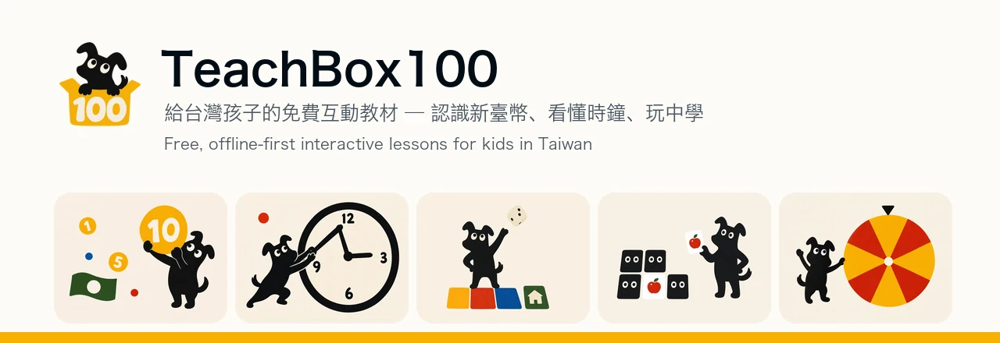

<div align="center">



# TeachBox100

**給台灣孩子的免費互動教材** —— 認識新臺幣、看懂時鐘、算找零，還有老師上課用得到的小遊戲。<br>
純前端、可離線、不用註冊。學齡前到國小、特教班都適合。

[](https://nextjs.org/)
[](https://react.dev/)
[](https://www.typescriptlang.org/)
[](https://tailwindcss.com/)
[](https://web.dev/progressive-web-apps/)
[](LICENSE)

[**線上試玩 →**](https://teachbox100.com) · [單元一覽](#單元) · [快速開始](#快速開始) · [參與貢獻](#參與貢獻)

</div>

---

## 這是什麼

老師在課堂上要教「50 元可以換幾個 10 元」，得自己準備教具；家長想讓孩子練習看時鐘，找到的 App 不是要註冊就是塞滿廣告。TeachBox100 把這些單元做成打開就能玩的網頁：**沒有帳號、沒有廣告、沒有後端**，網路斷了也還能用。

## 單元

| 單元 | 路徑 | 在教什麼 |
| --- | --- | --- |
| 認識新臺幣 | `/coin/introduction` | 每種硬幣、鈔票長什麼樣子，哪些組合價值一樣 |
| 金錢等值換算 | `/coin/equivalent` | 用不同的錢湊出一樣的金額 |
| 計算金錢價值 | `/coin/value` | 把一堆硬幣鈔票加起來 |
| 付款 | `/coin/pay` | 看商品價格，挑出剛好的錢 |
| 購物 | `/coin/buy` | 挑商品 → 算總價 → 付款，走完整流程 |
| 找零 | `/coin/change` | 算出該找多少，再把零錢湊出來 |
| 學習讀時鐘 | `/clock/current-time` | 分清時針分針，讀出幾點幾分 |
| 翻牌配對 | `/memory` | 記憶配對，可自訂卡片主題 |
| 大富翁 | `/monopoly` | 全班共用一台電腦輪流玩，題庫可匯入 |
| 抽籤轉盤 / 抽籤機 | `/draw/wheel`、`/draw/lottery` | 課堂點名、分組用的抽籤工具 |

## 快速開始

```bash
git clone https://github.com/<your-org>/teachbox100.git
cd teachbox100
pnpm install
pnpm dev            # http://localhost:3000
```

需要 **Node.js 20+**。環境變數只有 `NEXT_PUBLIC_*`（站台網址與分析工具 ID），已在 `.env` 內附預設值，開發時不必另外設定。

### 常用指令

| 指令 | 說明 |
| --- | --- |
| `pnpm dev` | 開發伺服器 |
| `pnpm build` / `pnpm start` | 產出並啟動 production build |
| `pnpm lint` | oxlint（含 type-aware 規則） |
| `pnpm test` / `pnpm test:coverage` | Vitest 單元測試 |
| `pnpm seo:snapshot` | 抓 Lighthouse／SEO 數據寫進 `docs/seo/history.md` |

## 設計原則

**兩種使用者，需求不同，都要顧。**

- **孩子（4–12 歲，含特教生）** —— 真正在操作的人。點擊目標要大、文字要少、失敗不能有懲罰感、動效要慢而溫和。不識字的孩子也要能靠圖示猜出怎麼玩。
- **老師／家長** —— 決定要不要用的人。需要一眼看懂單元在教什麼、能自己調難度、大富翁能匯入自己的題庫。

不能違反的限制：

| 限制 | 為什麼 |
| --- | --- |
| 純前端、可離線 | 教室網路不穩。PWA（`@serwist/next`），狀態進 `localStorage` |
| 不需要帳號 | 孩子沒有 email，老師不想幫全班開帳號 |
| 大富翁是單一螢幕 | 老師電腦／投影幕上全班共用，玩家輪流上前操作。**不做多裝置連線** |
| 動效要克制 | 前庭敏感的孩子會不舒服。一定要接 `prefers-reduced-motion` |
| 繁體中文台灣用語 | 「新臺幣」不是「人民幣」，「鈔票」不是「紙幣」 |

## 技術架構

| 層 | 選用 |
| --- | --- |
| 框架 | Next.js 15 App Router、React 19、TypeScript 5.9 |
| 樣式 | Tailwind CSS 4、shadcn/ui（Radix）、設計 token 集中在 `styles/globals.css` |
| 動效 | `motion`（Framer Motion）、`canvas-confetti`；大富翁物理用 matter-js |
| 狀態 | Zustand（僅遊戲單元），規則邏輯抽成純函式 |
| 音效 | Howler.js |
| 離線 | `@serwist/next` service worker |
| 分析 | PostHog、Umami（皆為 public key） |
| 測試 | Vitest |

### 目錄結構

```
app/                Next.js App Router；pages.config.ts 是首頁的唯一資料來源
components/         atoms / molecules / organisms / templates 分層
lib/                純邏輯：monopoly 規則、memory、lottery、hooks、helpers
public/images/      單元封面、硬幣、吉祥物（一律 webp）
docs/               設計 spec、SEO 紀錄
scripts/            SEO snapshot、IndexNow、GSC 排名查詢
```

## 開發慣例

- **首頁是 server component。** `app/page.tsx`、`PageDecor`、`ImageCard` 都沒有 `"use client"`。唯一的 client component 是 `ParallaxFallback`（無 markup，只掛 effect）。加東西前先想能不能維持
- **`app/pages.config.ts` 是首頁的唯一資料來源。** 新增單元 = 加一筆 + 放封面圖，格線與 sitemap 會自己接上
- **大富翁規則是純函式**（`lib/monopoly/rules.ts`），由 Zustand store 呼叫。測邏輯測那裡，不要測 store
- **設計 token 全在 `styles/globals.css`**，不要在元件裡寫死顏色
- `components/atoms/shadcn/` 的元件被改過，不要用 CLI 直接覆蓋
- 圖片一律 webp、用 `next/image` 並帶 `blurDataURL`
- **換圖要換檔名**破 Next 圖片快取，不要砍 `.next`（dev server 跑著的時候砍會白畫面）
- 只在客戶端能跑的套件（matter-js 等）要用 `next/dynamic` + `ssr: false`，否則 build 會噴不相干的 prerender 錯誤
- commit message 走 [Conventional Commits](https://www.conventionalcommits.org/)

## 參與貢獻

歡迎 issue 與 PR。送 PR 前請確認：

1. `pnpm lint` 與 `pnpm test` 都過
2. 新增的互動有接 `prefers-reduced-motion`
3. 文案是繁體中文台灣用語
4. 動 UI 之前先讀 [`.claude/memo/ui-style-guide.md`](.claude/memo/ui-style-guide.md)

回報問題時請附上瀏覽器、裝置，以及是哪個單元的哪一步。

## 延伸文件

| 文件 | 內容 |
| --- | --- |
| [`CONTEXT.md`](CONTEXT.md) | 領域詞彙 glossary（繁中／English／定義），含已知的命名踩雷點 |
| [`docs/superpowers/specs/2026-09-02-home-redesign.md`](docs/superpowers/specs/2026-09-02-home-redesign.md) | 設計語言、design token、動效原則、生圖 prompt 與後製流程 |
| [`docs/superpowers/specs/2026-06-01-monopoly-design.md`](docs/superpowers/specs/2026-06-01-monopoly-design.md) | 大富翁單元的設計決策 |
| [`docs/superpowers/specs/2026-09-02-page-transitions.md`](docs/superpowers/specs/2026-09-02-page-transitions.md) | 換頁轉場與上一頁行為：view transition 與捲動還原踩過的四個坑 |
| [`.claude/memo/ui-style-guide.md`](.claude/memo/ui-style-guide.md) | 動手改 UI 前的速查 + 已廢止寫法對照表 |

## 授權

| 範圍 | 授權 |
| --- | --- |
| 原始碼 | [MIT](LICENSE) |
| 圖片、插圖、音效等素材（`public/`、`docs/assets/`） | [CC BY-NC-SA 4.0](LICENSE-ASSETS) |

素材可自由用於教學與其他非商業用途，需標示來源，改作須沿用相同授權。商業使用請先聯絡。

© 2026 Eno Huang

